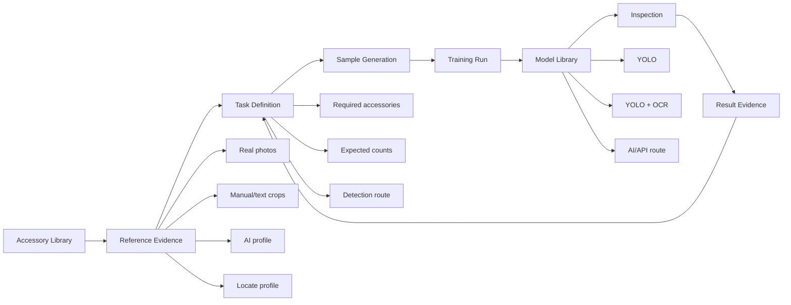
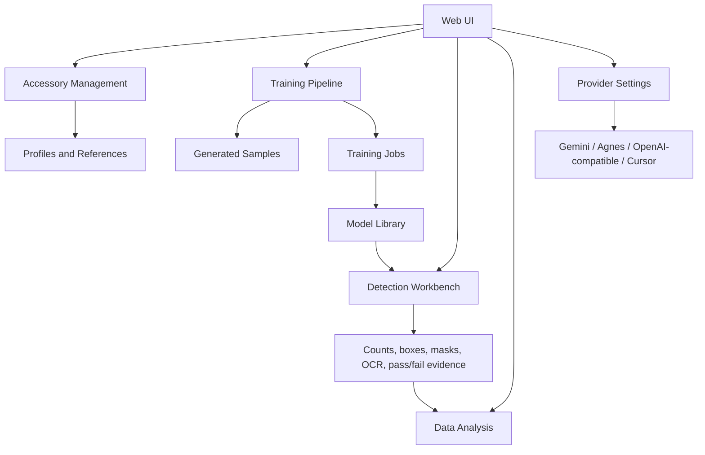

# VantaLine

VantaLine is a training workflow platform for visual inspection. It helps an
operator turn a changing set of physical accessories into an inspectable task:
collect references, build profiles, generate training samples, train or select a
model, run inspection, and feed the results back into the next training cycle.

The project is not a single bottle/manual detector. The bundled bottle and
manual assets are reference data used to validate the workflow. The product
boundary is the repeatable workflow for new inspection tasks.

## Why It Matters

Most inspection tools start from a fixed model and ask users to adapt their work
to it. VantaLine starts from the workflow:

- define the accessories that matter for a task,
- preserve the real reference evidence for each accessory,
- choose the right detection route per task,
- generate samples and train task-specific models,
- compare AI/API routes with trained YOLO routes,
- promote the best model into the inspection library.

That makes the system useful when the target changes frequently, when text-like
parts are visually similar, or when a production team needs an explicit path from
prototype AI detection to fast trained inspection.

## Innovation Points

| Area | What VantaLine Adds |
| --- | --- |
| Accessory-first task design | Tasks are composed from user-defined accessories and expected counts, not hard-coded classes. |
| Evidence-backed profiles | Each accessory can keep real photos, manual crops, AI profile text, LocateAnything profile data, and route metadata. |
| Multi-route inspection | A task can move between AI detection, LocateAnything, YOLO, and YOLO + OCR without changing the task concept. |
| Training workflow UI | Sample generation, training, model intake, and model library management are treated as one workflow. |
| Provider isolation | AI/API keys are scoped by provider, so Gemini, Agnes, OpenAI-compatible, Cursor, and other routes do not share an unsafe global key pool. |
| Iterative promotion | The workflow supports comparing candidate model behavior before making a trained model the active route. |

## Workflow



## Platform Design



## Detection Routes

| Route | Best For | Notes |
| --- | --- | --- |
| AI Detection | Early task validation and low-volume flexible checks. | Uses structured accessory profiles and provider-scoped keys. |
| LocateAnything | Open vocabulary localization and analysis workflows. | Useful when target selection is dynamic. |
| YOLO | Fast production inspection for trained visual targets. | Uses task-specific trained weights. |
| YOLO + OCR | Text-heavy accessories with similar shapes. | Combines localization with text evidence where a task supports OCR resolution. |

The same task can evolve across routes. A team can start with an API-backed
route, collect enough evidence, train a task model, and then promote the trained
model for faster repeated inspection.

## Product Surfaces

- Accessory library: create object or text-like accessories, upload references,
  crop text assets, and choose detection routes.
- Training pipeline: move accessories through task setup, sample generation,
  training, and model intake.
- Training library: keep trained model artifacts organized by task and route.
- Detection workbench: run image, video, or camera checks against the selected
  task.
- Data analysis: review inspection records and open localization runs.
- Settings: configure provider-specific keys and models for AI detection, image
  generation, and agent-assisted workflows.

## Repository Layout

```text
local_inspection_service/
  FastAPI application, inspection APIs, pipeline orchestration, React frontend,
  provider configuration, and task/runtime services.

local_inspection_service/frontend/
  React source for the current web application.

scripts/
  Utility scripts for dataset preparation and workflow maintenance.

tests/
  Focused regression and workflow tests.

backgrounds/
  Small reference background assets and metadata used by the bundled workflow.

standardized_manuals/
  Reference manual assets for the included validation task.

models/
  Selected deployable reference model artifacts and model notes.
```

Runtime data is intentionally not part of the repository. Uploads, generated
outputs, auth data, provider secrets, training job state, QA reports, handoff
notes, and temporary plans are ignored by Git.

## Quick Start

```bash
git clone https://github.com/JeffreyDeng-spec/VantaLine.git
cd VantaLine
python -m venv .venv
. .venv/bin/activate
python -m pip install -r requirements.txt
python -m uvicorn local_inspection_service.server:app --host 0.0.0.0 --port 8765
```

Then open the endpoint configured by your deployment environment.

For the React frontend:

```bash
cd local_inspection_service/frontend
npm install
npm run build
```

## Configuration

Provider configuration is environment-backed. The application stores references
to environment variable names, while secrets stay in the runtime environment or
the private runtime secret file.

Common provider variables:

```bash
INSPECTION_AI_PROVIDER=gemini
INSPECTION_AI_MODEL=gemini-2.5-flash
INSPECTION_AI_BASE_URL=https://generativelanguage.googleapis.com/v1beta
INSPECTION_AI_API_KEY_ENV=GEMINI_API_KEY
INSPECTION_AI_TIMEOUT_SECONDS=10
```

Image generation and agent routes use their own provider settings and active key
selection. A key belongs to one provider; a provider can have many keys.

## Reference Task

The repository includes a small reference configuration around one object and
several manual-like text accessories. It exists to exercise the workflow:

1. add mixed object/text accessories,
2. create normalized references and profiles,
3. generate training samples,
4. train or select a model,
5. inspect against task-level rules.

New deployments should define their own accessories, counts, sample policy,
route, and model artifacts instead of copying the reference task assumptions.

## Development Checks

Use checks that match the files changed:

```bash
python -m py_compile local_inspection_service/server.py
python -m py_compile local_inspection_service/scripts/*.py
npm --prefix local_inspection_service/frontend run typecheck
python local_inspection_service/scripts/verify_task_pipeline.py
python local_inspection_service/scripts/smoke_ai_detection.py
git diff --check
```

Some checks require configured provider keys, model artifacts, or OCR runtime
support.

## Repository Hygiene

The GitHub repository should contain durable source, selected reference assets,
tests, and documentation. It should not contain runtime state or team-local
execution records.

Ignored by design:

- `local_inspection_service/data/`
- `agent_handoffs/`
- `qa_reports/`
- `plans/`
- generated training runs and temporary image batches
- frontend build outputs and dependency folders
- provider keys, auth stores, logs, and process files

This keeps the repository focused on the reusable VantaLine workflow instead of
one machine's active runtime state.

## Status

VantaLine is under active development. The current direction is to make the
training workflow more explicit and reliable: accessory evidence first, task
definition second, then sample generation, model training, inspection, and
measured promotion.
